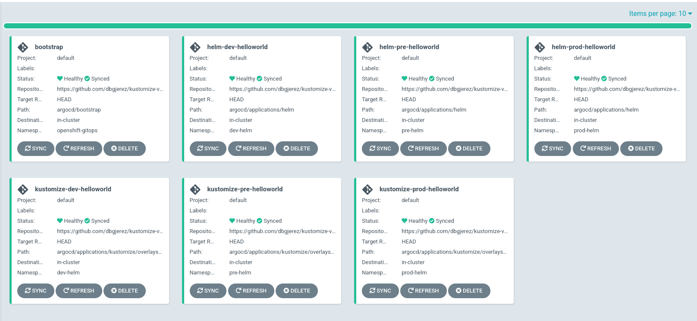
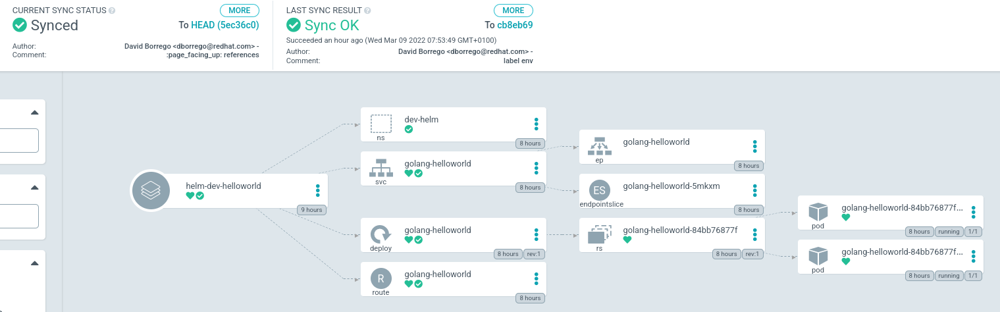

# kustomize-vs-helm
This repository show an example of use of Helm and Kustomize and follows the following objectives:
- Understand how works Kustomize
- Understand how works Helm
- Show the difference between both
- Use of both with an example using ArgoCD

## Kustomize
Kustomize lets you customize raw, template-free YAML files for multiple purposes, leaving the original YAML untouched and usable as is.

### Structure
The structure contains a ```base``` folder with the common descriptors and ```overlays``` folder with a folder for each environment.

> NOTE: An overlay is just another kustomization, referring to the base, and referring to patches to apply to that base.

Another important aspect is the ```kustomization.yaml``` file that contains some folders. This file indicates to Kustomize what files have to read and how, also some functions can be used to generate ConfigMap, prefixes, etc

```zsh
❯ tree
.
├── base
│   ├── hello-world.yaml
│   └── kustomization.yaml
└── overlays
    ├── dev
    │   ├── kustomization.yaml
    │   └── namespace.yaml
    └── pre
        ├── hello-world.yaml
        ├── kustomization.yaml
        └── namespace.yaml

4 directories, 7 files
```

### Usage
The use of Kustomize is simple. We'll use the example located inside the ```basic/kustomize``` folder.  

This example simulates two descriptors that change according to the environment.

The ```base``` folder contains the ```hello-world.yaml``` and each env contains a ```namespace.yaml``` file. 

```dev``` doesn't touch the ```hello-world.yaml``` file but add a new ```namespace.yaml``` file. If we execute:

```zsh
❯ kustomize build overlays/dev           
apiVersion: v1
kind: Namespace
metadata:
  name: dev
---
apiVersion: v1
kind: Test
metadata:
  name: hello-world
spec:
  message: hello
  replicas: 1
```

```pre``` also to do the same operations that ```dev```, modify inside the base file ```hello-world.yaml``` the key ```spec.message```:
```zsh
❯ kustomize build overlays/pre
apiVersion: v1
kind: Namespace
metadata:
  name: pre
---
apiVersion: v1
kind: Test
metadata:
  name: hello-world
spec:
  message: Hello world from pre!
  replicas: 1
```

> NOTE: Kustomize merges base and overlay files, but it needs a key to identify both files are the same. For that, uses the name and kind of the file, being impossible to change these values. 

## Helm
Helm is a package manager for Kubernetes, also works like template engine, facilitating the work with different applications and environment. 

### Structure
A chart contains a ```Chart.yaml``` file with the metadata of the chart. This file identifies the chart name, version, description, etc. 

Inside the ```templates``` folder we found a base of templates where the values are substitute. If we check a template file, we see some placeholders that references a ```{{ .Values...}}} ```.

Once the chart is finish, we only have to manage the values file. We can develop a file for each environment. 

```zsh
❯ tree
.
├── charts
├── Chart.yaml
├── templates
│   ├── hello-world.yaml
│   ├── namespace.yaml
│   └── tests
└── values.yaml

3 directories, 4 files
```

### Usage
The usage of Helm is basically executing a ```Chart``` with a ```values.yaml``` file. We can have so many values file as we need. The ```values.yaml``` file contain the default values that can be overwritten with or own values. 

> NOTE: In this example, we will use helm like a template engine. It's possible to package a chart and deploy it in a registry to be reused. 

```dev``` env contains the same values that the ```values.yaml``` so we don't need a special values file:

```zsh
❯ helm template .
---
# Source: helm-features/templates/namespace.yaml
apiVersion: v1
kind: Namespace
metadata:
  name: dev
---
# Source: helm-features/templates/hello-world.yaml
apiVersion: v1
kind: Test
metadata:
  name: hello-world
spec:
  message: hello
  replicas: 1
```

```pre``` env overwrites two values, so we have to create a ```values.yaml``` file with both. In this case, I've called it ```values-pre.yaml```. When we generate the templates, we have to indicate the file:

```zsh
❯ helm template -f values-pre.yaml .
---
# Source: helm-features/templates/namespace.yaml
apiVersion: v1
kind: Namespace
metadata:
  name: pre
---
# Source: helm-features/templates/hello-world.yaml
apiVersion: v1
kind: Test
metadata:
  name: hello-world
spec:
  message: Hello world from pre!
  replicas: 1
```

## Example
In this example we will deploy the same application using Kustomize and Helm. The application will be deployed in different environment which are represented as namespaces.

I've chosen an easy golang application, but it's indifferent the application to use given that we're running a container. The data of application are:

| Application       | Repository                                             | Image                             |
|-------------------|--------------------------------------------------------|-----------------------------------|
| golang-helloworld | https://github.com/dbgjerez/golang-k8s-helm-helloworld | b0rr3g0/golang-hello-world:latest |

### ArgoCD
ArgoCD is a declarative, GitOps continous delivery tool for Kubernetes. 

We'll use ArgoCD as the orchestrator of lifecycle of our applications. This meaning that they ArgoCD have the responsibility to synchronize the state, stored in git, with the Kubernetes cluster. 

So... What is the responsibility of Helm or Kustomize?. It's ArgoCD which are going to call the commands necessaries to get the final manifest, so the responsibility is only to work as template engine. 

#### Structure
Inside the ```argocd``` folder we can found some folders: ```installation```, ```bootstrap``` and ```applications```.
- **installation:** folder with operator and argocd server descriptor.
- **bootstrap:** once you've installed argocd, you can initialize the argocd objects. This point only need as prerequisite an ArgoCD server instance. 
- **applications:** kustomize and helm to deploy the application along the namespaces.

#### Run
To run the complete example, you only have to apply the bootstrap application. This application link two ApplicationSet, one for Helm and another for Kustomize. 

Each ApplicationSet creates many Applications as environments we have. 

Once each Application is created, they synchronize the state between or cluster to the git repository. 

```zsh
❯ oc apply -f argocd/installation/argocd-app-bootstrap.yaml 
application.argoproj.io/bootstrap created
```

If we wait some seconds, we can check that all the applications have been created:



In addition, if we click any application, we can see the resources deployed to run our instance. For example, the dev application with helm:



Finally, we'll check that all ours instances are running: 
```zsh
❯ oc get route -A | \
  grep golang-helloworld | \
  awk '{print $3}' | \
  xargs -I {} curl -sL -w " [%{http_code}] [{}] \\n" {}/api/v1/grettings 
{"msg":"Hello world"} [200] [golang-helloworld-dev-helm.apps.cluster-da16.sandbox362.opentlc.com] 
{"msg":"Hello world"} [200] [golang-helloworld-dev-kustomize.apps.cluster-da16.sandbox362.opentlc.com] 
{"msg":"Hello world"} [200] [golang-helloworld-pre-helm.apps.cluster-da16.sandbox362.opentlc.com] 
{"msg":"Hello world"} [200] [golang-helloworld-pre-kustomize.apps.cluster-da16.sandbox362.opentlc.com] 
{"msg":"Hello world"} [200] [golang-helloworld-prod-helm.apps.cluster-da16.sandbox362.opentlc.com] 
{"msg":"Hello world"} [200] [golang-helloworld-prod-kustomize.apps.cluster-da16.sandbox362.opentlc.com]
```

## References
- [Helm](https://helm.sh/docs/)
- [Kustomize](https://kubectl.docs.kubernetes.io/)
- [ArgoCD](https://argo-cd.readthedocs.io/en/stable/)
- [Golang example application](https://github.com/dbgjerez/golang-k8s-helm-helloworld)